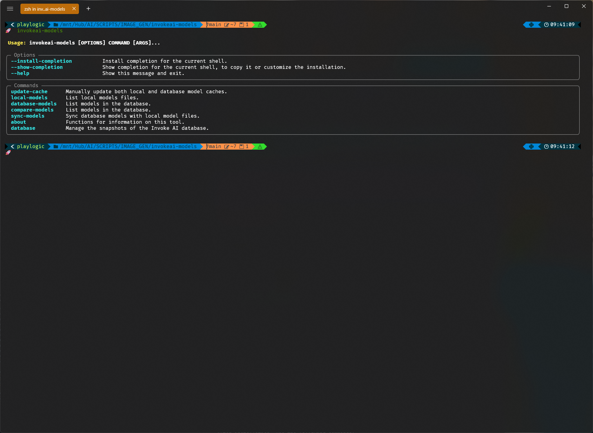

# InvokeAI Preset CLI

> [!IMPORTANT]
> This tool makes changes to the Invoke AI database and while it does make snapshots before operations
> that write to a table, there is always a chance the data could become corrupted. Use stand-alone tools
> if you are paranoid about losing data. This tool is provided as-is and is not guaranteed to work in all
> environments. It is recommended to backup your database before using this tool at least once.

## Overview

**InvokeAI Preset CLI** is a simple CLI tool that streamlines the process of managing large
entries of presets into the Invoke AI. The tool was primarily designed to allow me to quickly
add, update, and delete presets in bulk.

Presets/styles can be found at the [gist.github.com/regiellis](https://gist.github.com/regiellis/af5fc6a046d69d62036c6e9be2ff08da)
make sure to use the raw link to import the styles.

These styles are re-post of the work from the great people at:
[twri](https://github.com/twri), [3Diva](https://github.com/3Diva), [Marc K3nt3L](https://github.com/K3nt3L), and the
[fooocus](https://github.com/lllyasviel/Fooocus) project. Show your love on their projects.




## Why

Just wanted a easy way to get presets in and out of the database without having to use the web interface. The web interface is great for one-off presets,
and does have a bulk import feature, but I wanted to be able to do it from the command line with a litte more control over the process. I have also
added a few features that are not available in the web interface.


## Installation (Recommended)

You have a couple of options for installing/running the tool:

### Install [pipx](https://pipxproject.github.io/pipx/installation/), then run the tool with the following command

```bash
pipx install invokeai-presets-cli
```

### Alternatively, you can install using `pip`

```bash
pip install .
```

## Configuration

> [!IMPORTANT]
> Before using the tool, It's required to set up a `.env` file in the parent directory of the script or your home user dir [windows] or `$HOME/.config/invoke-presets-itsjustregi/.env`
> You will be asked to create a new `.env` file if it does not exist.

The application intelligently locates your `.env` file, accommodating various platforms like Windows and Linux, or defaulting to the current directory.

## Usage // Available Commands

Once installed via pipx or pip:

```
invoke-presets about -readme -changelog -version [-c, -r, -v]
invoke-presets list [--all, --only-defaults]
invoke-presets database create-snapshot
invoke-presets database list-snapshots
invoke-presets database delete-snapshot
invoke-presets database restore-snapshot
invoke-presets tools
invoke-presets export 
invoke-presets import 
invoke-presets delete
```


### Contact

For any inquiries, feedback, or suggestions, please feel free to open an issue on this repository.

### License

This project is licensed under the [MIT License](LICENSE).

---
